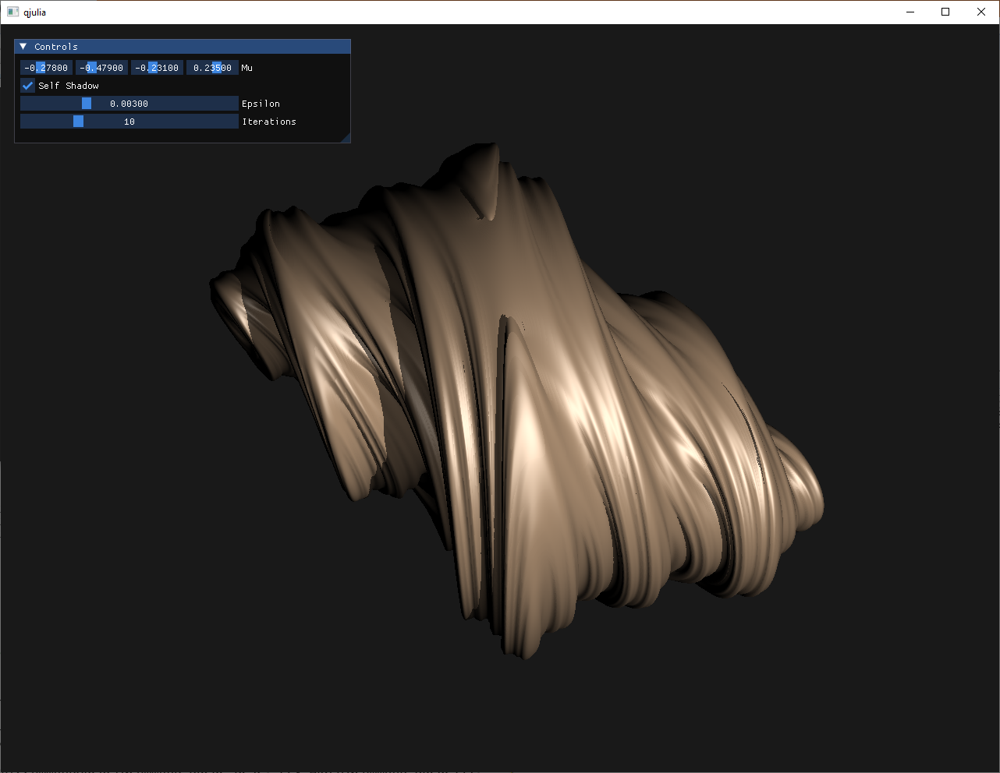
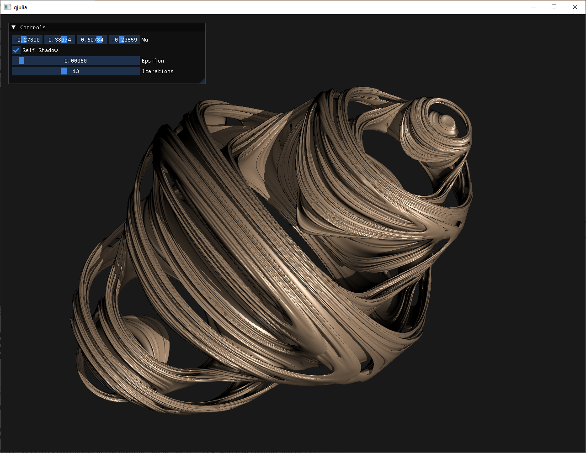
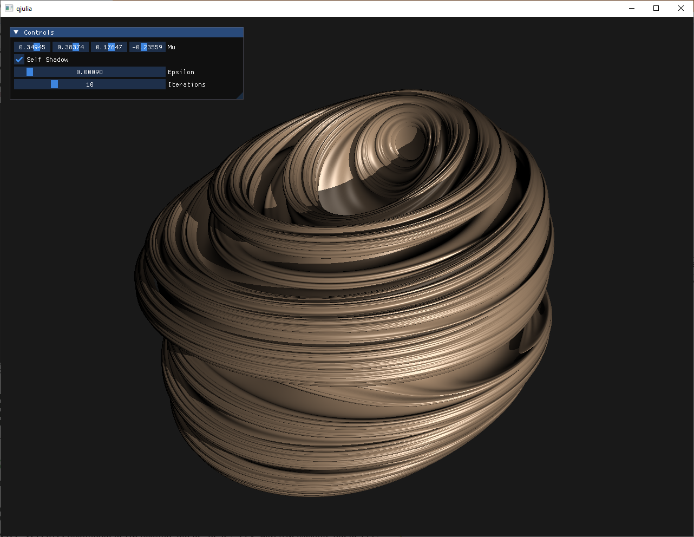

# qjulia
 
This is an implementation of Keenan Crane's article "Ray Tracing Quaternion Julia Sets on the GPU" (https://www.cs.cmu.edu/~kmcrane/Projects/QuaternionJulia/paper.pdf) in C++ & D3D12.

Special thanks to ychding11's implementation (https://github.com/ychding11/QJulia4D) which served as a very helpful reference (especially for the trackball).

# Setup

Requirements:
- Visual Studio 2015 + Win10 SDK, or newer
- DXC, MUST BE IN THE PATH! (https://github.com/microsoft/DirectXShaderCompiler)

This project can only be built for 64-bit! Open a Visual Studio developer command prompt (eg, `VS2015 x64 Native Tools Command Prompt`) and run the following:
```
git clone https://github.com/matthewgeorgy/qjulia.git
cd qjulia
make.bat
cd bin
qjulia.exe
```

# Controls

- Left click + mouse move : rotate fractal
- Scroll up : zoom in
- Scroll down : zoom out
- Use the GUI to modify the fractal detail, and to enable/disable self-shadowing

# Samples





